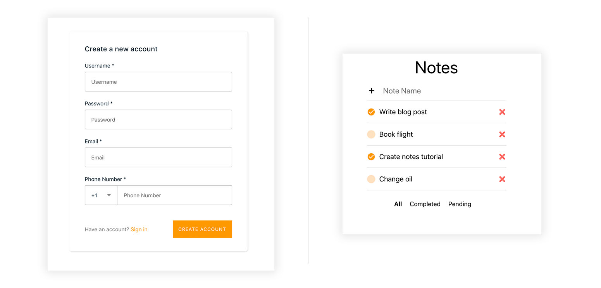
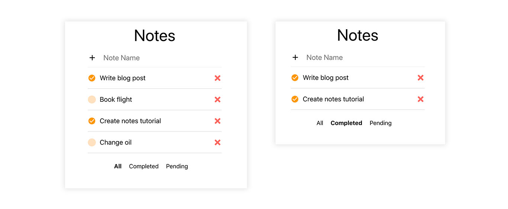
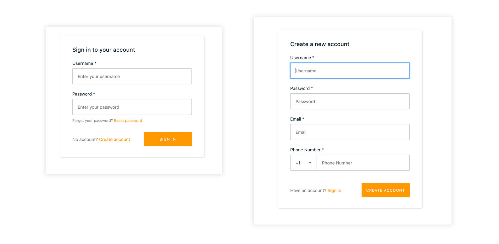
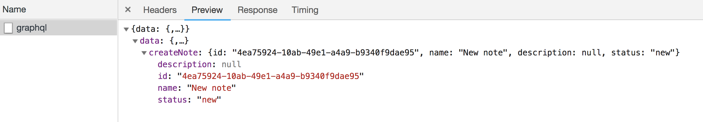

# Building a ‘Notes’ app with Amplify Framework and React

### Overview
In this tutorial, you will create a React 'Notes’ app that connects to a serverless backend via the Amplify Framework. The app will provide user authentication with Amazon Cognito, in-app analytics with Amazon Pinpoint, and it will be connected to a serverless GraphQL backend with AWS AppSync.



The Amplify Framework enables frontend developers to build apps quickly with a simplified workflow. In this tutorial, you will learn how to create a cloud-enabled React app from scratch using the Amplify Framework. You can deploy this fullstack application to the Amplify Console by clicking the button below.

[](https://console.aws.amazon.com/amplify/home#/deploy?repo=https://github.com/username/repository)

#### By completing this tutorial, you will be able to:

- Bootstrap a React app with Create React App CLI
- Install and configure the Amplify Framework in your app
- Manage your app’s backend with the Amplify CLI
- Add cloud-based authentication to your app
- Create and use a GraphQL backend to store data

### Prerequisites
You need to have a basic understanding of JavaScript, Node.js, and NPM to complete this tutorial.

### Source Code
You can directly copy and paste code snippets from the tutorial as you are following the steps. Alternatively, if you would like to get right to the source code for the final version of the tutorial’s code, please visit the Github Repo.

## Content
Here is the sequence of the tutorial:

[Part 1: Creating the React App](https://github.com/dabit3/react-notes#part-1-create-a-react-app)   
[Part 2: Adding Cloud Features](https://github.com/dabit3/react-notes#part-2-adding-cloud-features)   
[Part 3: Enabling GraphQL Backend](https://github.com/dabit3/react-notes#part-3-enabling-graphql-backend)

# Part 1: Create a React App

This section introduces React basics. You will learn how to bootstrap a new React app with the Create React App CLI. In subsequent parts of the tutorial, you will gradually add new cloud functionality to your application.

> If you want to integrate Amplify Framework into an existing React application, you can skip Part 1 and start directly to Part 2.

### Install the Create React App CLI and Create a New Project
The easiest way to create an React application is with the Create React App Command Line Interface (CLI). To install the CLI, run the following command in your terminal:

```sh
$ npm install -g create-react-app
```

After the installation, go to a location where you wish to start your new application project and execute the following command to create a new React app:

```sh
$ create-react-app react-notes
```

### Install Amplify Framework Libraries

Now, you have a new React project called react-notes! You can switch to your project’s root folder and install required Amplify Framework libraries.

```sh
$ cd react-notes
```

Amplify Framework provides npm packages for installation. aws-amplify is the core package and aws-amplify-react includes UI components and React modules that you will use when building you React app.

Run the following commands to install required packages:

```sh
$ npm install aws-amplify aws-amplify-react
```

You have installed the required Amplify packages in this step. In Part 2, you will use those packages to cloud-enable your React app.


#### Testing your React App

You can test your React app anytime in a browser by running:

```sh
$ npm start
```

## Creating Components

In this section, we'll create the components that we will use in our React app. These components will at first use local state to manage data. Later on, we'll update our application to work with data from the cloud by adding an AppSync GraphQL API.



The next thing we'll need to do is install a couple of additional dependencies (Glamor for styling & React Icons for Icons):

```sh
npm install react-icons glamor
```

Next, we'll need to create a few new files to hold our components.

In the `src` directory, create a `components` directory with three new components: __Form.js__, __Note.js__, & __Notes.js__:

```sh
mkdir components
touch components/Form.js components/Note.js components/Notes.js
```

Next, we'll update App.js. App.js will hold most of the logic for creating, updating & deleting items in our app.

First, let's import everything we'll need for the component:

```js
// src/App.js

import { css } from 'glamor'

import Form from './components/Form'
import Notes from './components/Notes'
```

Next, in our class, we'll define the initial state:

```js
state = { notes: [], filter: 'none' }
```

- The `notes` array will hold the notes we will be rendering in our app.
- The `filter` value will hold the current filter for the type notes that we are viewing (all notes, completed notes, or pending notes).

Next, we'll define the methods we'll be needing:

```js
createNote = async note => {
  const notes = [note, ...this.state.notes]
  const newNotes = this.state.notes
  this.setState({ notes })
}

updateNote = async note => {
  const updatedNote = {
    ...note,
    status: note.status === 'new' ? 'completed' : 'new'
  }
  const index = this.state.notes.findIndex(i => i.id === note.id)
  const notes = [...this.state.notes]
  notes[index] = updatedNote
  this.setState({ notes })
}

deleteNote = async note => {
  const input = { id: note.id }
  const notes = this.state.notes.filter(n => n.id !== note.id)
  this.setState({ notes })
}

updateFilter = filter => this.setState({ filter })
```

- `createNote` - This method creates a new note in the state.

- `updateNote` - This method updates the `status` of the note to be either __completed__ or __new__.

- `deleteNote` - This method deletes the note from the state.

- `updateFilter` - This method changes the filter type that we are currently viewing.

Next, we'll update the render method to the following:

```js
render() {
  let { notes, filter } = this.state
  if (filter === 'completed') {
    notes = notes.filter(n => n.status === 'completed')
  }
  if (filter === 'new') {
    notes = notes.filter(n => n.status === 'new')
  }
  return (
    <div {...css(styles.container)}>
      <p {...css(styles.title)}>Notes</p>
      <Form
        createNote={this.createNote}
      />
      <Notes
        notes={notes}
        deleteNote={this.deleteNote}
        updateNote={this.updateNote}
      />
      <div {...css(styles.bottomMenu)}>
        <p
          onClick={() => this.updateFilter('none')}
          {...css([ styles.menuItem, getStyle('none', filter)])}
        >All</p>
        <p
          onClick={() => this.updateFilter('completed')}
          {...css([styles.menuItem, getStyle('completed', filter)])}
        >Completed</p>
        <p
          onClick={() => this.updateFilter('new')}
          {...css([styles.menuItem, getStyle('new', filter)])}
        >Pending</p>
      </div>
    </div>
  );
}
```

- We first destructure the `notes` array & the `filter` value from the state.
- Next, we apply the filter on the notes array if there is a filter that matches either `completed` or `new`.
- We return the __Form__ & __Notes__ components as well as some UI to apply the filter.

Finally, we have a few styles that we create to style our UI:

```js
const styles = {
  container: {
    width: 360,
    margin: '0 auto',
    borderBottom: '1px solid #ededed',
  },
  form: {
    display: 'flex',
    justifyContent: 'center',
    alignItems: 'center'
  },
  input: {
    height: 35,
    width: '360px',
    border: 'none',
    outline: 'none',
    marginLeft: 10,
    fontSize: 20,
    padding: 8,
  }
}
```

Now, let's take a look at the __Note__ component (components/Note.js):

```js
// src/components/Note.js

import React from 'react'
import { css } from 'glamor'
import { FaTimes, FaCircle } from 'react-icons/fa'
import { MdCheckCircle } from 'react-icons/md';

class Note extends React.Component {
  render() {
    const { name, status } = this.props.note
    return (
      <div {...css(styles.container)}>
        {
          status === 'new' && (
            <FaCircle
              color='#FF9900'
              {...css(styles.new)}
              size={22}
              onClick={() => this.props.updateNote(this.props.note)}
            />
          )
        }
        {
          status === 'completed' && (
            <MdCheckCircle
              {...css(styles.completed)}
              size={22}
              color='#FF9900'
              onClick={() => this.props.updateNote(this.props.note)}
            />
          )
        }
        <p {...css(styles.name)}>{name}</p>
        <div {...css(styles.iconContainer)}>
          <FaTimes
            onClick={() => this.props.deleteNote(this.props.note)}
            color='red'
            size={22}
            {...css(styles.times)}
          />
        </div>
      </div>
    )
  }
}

const styles = {
  container: {
    borderBottom: '1px solid rgba(0, 0, 0, .15)',
    display: 'flex',
    alignItems: 'center'
  },
  name: {
    textAlign: 'left',
    fontSize: 18
  },
  iconContainer: {
    display: 'flex',
    flex: 1,
    justifyContent: 'flex-end',
    alignItems: 'center'
  },
  new: {
    marginRight: 10,
    cursor: 'pointer',
    opacity: .3
  },
  completed: {
    marginRight: 10,
    cursor: 'pointer'
  },
  times: {
    cursor: 'pointer',
    opacity: 0.7
  }
}

export default Note
```

This component is pretty basic: we return the note `name` as well as some UI for updating & deleting the note.

If the note is `new`, we show an empty circle next to the note.

If the note is `completed`, we show a circle with a checkmark next to it. If the circle is clicked, we call the `updateNote` method passed down as props & toggle the `completed` state..

We also have a red __x__ that deletes the note when clicked by calling the `deleteNote` method passed down as props.

Next, let's take a look at __Notes__ component (Notes.js):

```js
// src/components/Notes.js

import React from 'react'
import { css } from 'glamor'

import Note from './Note'

class Notes extends React.Component {
  render() {
    return (
      <div {...css(styles.container)}>
        {
          this.props.notes.map((t, i) => (
          <Note
            key={i}
            note={t}
            deleteNote={this.props.deleteNote}
            updateNote={this.props.updateNote}
          />
          ))
        }
      </div>
    )
  }
}

const styles = {
  container: {
    width: '360px',
    margin: '0 auto',
    '@media(max-width: 360px)': {
      width: 'calc(100% - 40px)'
    }
  }
}

export default Notes
```

In this component, we map over all of the notes (passed in as `this.props.notes`), & render a __Note__ component for each item in the array.

We pass in the `deleteNote` & `updateNote` methods as props to each __Note__ component along with the note.

Finally, let's take a look at the __Form__ component (components/Form.js):

```js
// src/components/Form.js

import React from 'react'
import { css } from 'glamor'
import { MdAdd } from 'react-icons/md'

class Form extends React.Component {
  state = { name: '' }
  onChange = e => {
    this.setState({ name: e.target.value })
  }
  handleKeyPress = (e) => {
    if (e.key === 'Enter' && this.state.name !== '') {
      const note = {
        ...this.state, status: 'new'
      }
      this.props.createNote(note)
      this.setState({ name: '' })
    }
  }
  render() {
    return (
      <div {...css(styles.container)}>
        <div {...css(styles.form)}>
          <MdAdd size={28} />
          <input
            placeholder='Note Name'
            {...css(styles.input)}
            onKeyPress={this.handleKeyPress}
            onChange={e => this.onChange(e)}
            value={this.state.name}
          />
        </div>
      </div>
    )
  }
}

const styles = {
  container: {
    width: 360,
    margin: '0 auto',
    borderBottom: '1px solid #ededed',
  },
  form: {
    display: 'flex',
    justifyContent: 'center',
    alignItems: 'center'
  },
  input: {
    height: 35,
    width: '360px',
    border: 'none',
    outline: 'none',
    marginLeft: 10,
    fontSize: 20,
    padding: 8,
  }
}

export default Form
```

This component renders a basic form. In the component we listen for an __enter__ `keyPress` event. If the key is the __Enter__ key, we call `this.props.createNote`, passing in the value in the text input.

## Testing Your Components

Now, a working shell for our application if completed & should work with local state. Let's test it out:

```sh
npm start
```

You should be able to create, update & delete todos in your app. You'll notice that when you refresh, the data goes away. We'll fix this in a later step by storing our data in an AppSync API & fetching it when the app loads.

# Part 2: Adding Cloud Features

In this section, you will cloud enable your React app using the Amplify CLI.

### Install Amplify CLI

Amplify CLI is the command line tool that you will use to create and manage the backend for your React app. In the upcoming sections, you will use Amplify CLI to simplify various operations. The CLI enables you to create and configure your backend quickly, even without leaving the command line!

### Installing and Configuring the CLI

To use Amplify CLI with your project, you need to install it to your local development machine and configure it with your AWS credentials. Configuration is a one-time effort; once you configure the CLI, you can use it on multiple projects on your local machine. Because the CLI creates backend resources for you, it needs to utilize an AWS account with appropriate IAM permissions. During the configuration step, a new IAM role will be automatically created on your AWS account.

To install and configure the Amplify CLI, run the following commands:

```sh
$ npm install -g @aws-amplify/cli

$ npm amplify configure
```

> For a video walkthrough of how to configure the Amplify CLI, check out [this](https://www.youtube.com/watch?v=fWbM5DLh25U) video.

### Amplify CLI vs. AWS Console

The backend resources that are created by the CLI is available to you through the AWS Console, e.g., you can access your Amazon Cognito User Pool on the AWS Console after you enable auth with Amplify CLI.

> To learn about Amplify CLI, visit the CLI developer documentation.

### Initialize Your Backend

To initialize your backend, run the following command in your project’s root folder:

```sh
$ amplify init
```

The CLI guides you through the options for your project. Select `React` as your framework when prompted:

```sh
 Please tell us about your project
  ? What javascript framework are you using
  ❯ react
    react-native
    angular
    ionic
    vue
    none
```

When the CLI successfully configures your backend, the backend configuration files are saved to `/amplify` folder. You don’t need to manually edit the content of this folder as it is maintained by the CLI.

### Adding Analytics

Let’s add our first backend feature to our app, Analytics. Adding Analytics won’t change the user experience though, but it will provide valuable metrics that you can track in Amazon Pinpoint dashboard.

While enabling Analytics, you will also learn how to use Amplify CLI and configure your app to work with various backend services.

### How the Amplify CLI works?

When you deploy your backend with Amplify CLI, here is what happens under the hood:

1. The CLI creates and provisions related resources on your account
2. The CLI updates your ‘/amplify’ folder, which has all the relevant information about your backend on AWS
3. The CLI updates the configuration file aws-exports.js with the latest resource credentials

As a front-end developer, you need to import the auto generated aws-exports.js configuration file in your React app, and configure your app with Amplify.configure() method call.

So, to enable analytics to your application, run the following commands:

```sh
$ amplify add analytics
$ amplify push
```

After successfully executing the push command, the CLI updates your configuration file _aws-exports.js_ in your ‘/src’ folder with the references to the newly created resources.

## Working with The Configuration File

The next step is to import _aws-exports.js_ configuration file into your app.

To configure your app, open __src/App.js__ file and make the following changes in code:

```js
import Amplify, { Analytics } from 'aws-amplify';
import aws_exports from './aws-exports';

Amplify.configure(aws_exports);
```

### Monitoring App Analytics

Refresh your application a couple of times, and then you will automatically start receiving usage metrics in the Amazon Pinpoint console.

To view the Amazon Pinpoint console, visit [https://console.aws.amazon.com/pinpoint/home/](https://console.aws.amazon.com/pinpoint/home/) & select the region where you created the service.

Since your application doesn’t have much functionality at the moment, only ‘session start’ events are displayed in Pinpoint Console. As you add more cloud features to your app - like authentication - Amplify will automatically report related analytics events to Amazon Pinpoint. So, you will know how your users are interacting with your app.

### Adding Authentication

Now that you know how to utilize Amplify CLI to enable backend services, you can continue to add new features to your React app easily.

User authentication will be the next cloud feature you will enable.

If you have been following the tutorial from the start and enabled Analytics in the previous step, auth is already enabled for your app (analytics needs secure credentials for reporting metrics). In this case, you just need to run update auth command to create a User Pool that will store your registered users:

```sh
$ amplify update auth

> Do you want to use the default authentication and security configuration? Yes, use the default configuration.

$ amplify push
```

If you have not enabled Analytics earlier, you will be using auth features for the first time. Run the following command:

```sh
$ amplify add auth
$ amplify push
```

When prompted by the CLI, chose ‘default configuration’:

```sh
Do you want to use the default authentication and security configuration?
❯ Yes, use the default configuration. 
```

> AWS Amplify’s Authentication category works with Amazon Cognito, a cloud-based authentication and federation service that enables you to manage user access to your applications.

## Enabling the UI Components for Auth

One of the most important benefits of Amplify Framework is that you don’t need to implement standard app features - like user authentication - from scratch. Amplify provides UI components that you can integrate into your app with just a few lines of code.

## Rendering the Auth UI

Now, let’s put the auth UI components in our home page. We'll be using the `withAuthenticator` higher order component from the _aws-amplify-react_ library.

The `withAuthenticator` component renders a pre-built sign-in and sign-up flow with full-fledged auth functionality like user registration, password reminders, and Multi-factor Authentication.

Open __src/App.js__. Import the `withAuthenticator` component & replace the default export for the component:

```js
import { withAuthenticator } from 'aws-amplify-react'

export default withAuthenticator(App, { includeGreetings: true })
```

### Test Your Auth Flow

Now, refresh your app. Once your application loads, you will see login/signup controls.



### Where is the user data stored?

When a new user registers through the `withAuthenticator` component, the user data is stored in your Cognito User Pool. A user pool is a user directory in Amazon Cognito. With a user pool, your users can sign in to your app through Amazon Cognito. You can visit [Amazon Cognito console](https://console.aws.amazon.com/cognito/home), and see the list of registered users by selecting the User Pool that is created for your app.

# Part 3: Enabling GraphQL Backend

So far, your app is powered by Amazon Cognito User Pools, but we do not yet have any real yet as far as storing data. In this part, you will integrate your app with a GraphQL API (powered by AWS AppSync) that will store your notes in a NoSQL database (Amazon DynamoDB).

### What is GraphQL?

GraphQL is a modern way of building APIs for your apps and interacting with your backend. It has many benefits over REST – such as using a single endpoint, powerful query syntax, data aggregation from multiple sources and a type system to describe the data – but the overall goal is to make your front-end development experience easy and more productive.

The Amplify CLI will also help you when creating the GraphQL backend.

### Create a GraphQL API

In the root folder of your app project, run the following command:

```sh
amplify add api
```

Then, select GraphQL as the service type:

```sh
? Please select from one of the below mentioned services (Use arrow keys)
❯ GraphQL
  REST
```

> API category supports GraphQL and REST endpoints. In this tutorial, we will create our backend on GraphQL, which uses AWS AppSync.

When you select GraphQL as the service type, the CLI offers you options to create a schema. A schema defines the data model for your GraphQL backend.

Select Single object with fields when prompted What best describes your project?. This option will create a GraphQL backend data model which we can modify and use in our app:

```sh
? Provide API name: reactnotes
? Choose an authorization type for the API Amazon Cognito User Pool
Use a Cognito user pool configured as a part of this project
? Do you have an annotated GraphQL schema? No
? Do you want a guided schema creation? true
? What best describes your project:
? What best describes your project: Single object with fields (e.g., “Todo” with ID, name, description)
? Do you want to edit the schema now? Yes
```

This should open a GraphQL schema in your text editor (located at amplify/backend/api/reactnotes/schema.graphql).

Update the schema to the following & save the file:

```graphql
type Note @model {
  id: ID!
  name: String!
  description: String
  status: String!
}
```

Deploy your GraphQL backend:

```sh
$ amplify push
```

When prompted, choose code generation language target as JavaScript:

```sh
? Do you want to generate code for your newly created GraphQL API: Yes
? Choose the code generation language target: javascript
? Enter the file name pattern of graphql queries, mutations and subscriptions: src/graphql/**/*.js
? Do you want to generate/update all possible GraphQL operations - queries, mutations and subscriptions: Yes
```

### Using GraphQL Queries and Mutations

When working with a GraphQL API, you pass queries - or mutations - to the GraphQL endpoint. Queries are used for read operations, and mutations perform create, update & delete operations.

A query/mutation has a simple, JSON-like format, but you don’t need to write it manually. Instead, the Amplify CLI can auto-generate queries and mutations for you.

## Auto-Generating Queries/Mutations

When you updated your GraphQL schema, selecting Do you want to update code for your updated GraphQL API option generated queries and mutations that you need. The CLI also saved your generated queries and mutations under ‘src/graphql’ folder.

> You can auto-generate queries and mutations anytime by running the `$ amplify codegen` command.

When you check the `src/graphql` folder, you will see that the CLI has generated a list of queries, mutations, & subscriptions for common data operations. You will use them to perform CRUD (create-read-update-delete) operations on your data:

| TYPE          | OPERATIONS                       |
| ------------- | -------------                    |
| query         | getNote , listNotes              |
| mutation | createNote , updateNote , deleteNote  |

## Running Queries/Mutations

To run a query or mutation, you import it in your app, and use Amplify `API` category to perform the operation:

```js
import Amplify, { API, graphqlOperation } from "aws-amplify";
import { listNotes } from './graphql/queries';

const allNotes = await API.graphql(graphqlOperation(listNotes));
console.log(allNotes);
```

Let's take a look at how to do this in our app.

## Connecting to the GraphQL Backend & Updating Your App

Currently, your GraphQL API and related backend resources (an Amazon DynamoDB table that stores the data) have been deployed to the cloud. Now, we can update the functionality to our app by integrating the GraphQL backend.

To do so, we'll open __App.js__ & do the following:

1.  Import the components & queries we'll need to interact with the API:

```js
// import API & graphqlOperation helpers from AWS Amplify
import { API, graphqlOperation } from 'aws-amplify'

// import the mutations & queries we'll need to interact with the API
import { createNote, updateNote, deleteNote } from './graphql/mutations'
import { listNotes } from './graphql/queries'
```

2. Add a __ComponentDidMount__ lifecycle method to fetch the data from the AppSync API when the app loads & update the state:

```js
async componentDidMount() {
  try {
    const { data: { listNotes: { items }}} = await API.graphql(graphqlOperation(listNotes))
    this.setState({ notes: items })
  } catch (err) {
    console.log('error fetching notes...', err)
  }
}
```

Here, we call the API & fetch all of the notes. When the data is returned, we update the notes array to the data that was returned from the API.

3. Update the __createNote__ method to create the note in the AppSync API:

```js
createNote = async note => {
  const notes = [note, ...this.state.notes]
  const newNotes = this.state.notes
  this.setState({ notes })
  try {
    const data = await API.graphql(graphqlOperation(createNote, { input: note }))
    this.setState({ notes: [data.data.createNote, ...newNotes] })
  } catch (err) {
    console.log('error creating note..', err)
  }
}
```

This method calls the API & creates a new note. We still provide an optimistic response as to update the UI as soon as the user creates the note without waiting for the response from the API.

4. Update the __updateNote__ method to update the note in the AppSync API:

```js
 updateNote = async note => {
  const updatedNote = {
    ...note,
    status: note.status === 'new' ? 'completed' : 'new'
  }
  const index = this.state.notes.findIndex(i => i.id === note.id)
  const notes = [...this.state.notes]
  notes[index] = updatedNote
  this.setState({ notes })

  try {
    await API.graphql(graphqlOperation(updateNote, { input: updatedNote }))
  } catch (err) {
    console.log('error updating note...', err)
  }
}
```

This method updates the status of the note to be either completed or new. We also provide an optimistic response.

5. Update the __deleteNote__ method to delete the note in the AppSync API:

```js
deleteNote = async note => {
  const input = { id: note.id }
  const notes = this.state.notes.filter(n => n.id !== note.id)
  this.setState({ notes })
  try {
    await API.graphql(graphqlOperation(deleteNote, { input }))
  } catch (err) {
    console.log('error deleting note...', err)
  }
}
```

This method deletes the note from the API. We also still provide an optimistic response.

### Testing it out

You have just implemented GraphQL queries and mutations in your CRUD functions. Now, you can test your app and verify that the app data is persisted using your GraphQL backend!

```sh
npm start
```

Inspecting a GraphQL Mutation

Let’s see what is happening under the hood. Run your app, and add a new item while you monitor the network traffic in your browser’s developer tools. Here is what you will see for a mutation HTTP request: 



When you check the request header, you will notice that the Request Payload has the note item data in JSON format.

__Congratulations! You now have a cloud-powered React app!__

You’ve persisted your app’s data using AWS AppSync and Amazon DynamoDB.

### What’s next?

You have completed this tutorial. However, if you like to improve your app even further, here are some ideas you can consider.

#### Deploy your app using the Amplify Console

The AWS Amplify Console is a continuous deployment and hosting service for mobile web applications. The AWS Amplify Console makes it easy for you to rapidly release new features, helps you avoid downtime during application deployment, and handles the complexity of simultaneously updating the frontend and backend of your applications. To learn more about the Amplify console, check out [the documentation](https://docs.aws.amazon.com/amplify/latest/userguide/welcome.html).

#### Work with User Data

You may have noticed that our Note GraphQL schema doesn’t have a user id field. It means that the notes list is not personalized for your app users. To fix that, you can retrieve the user id after login, and use it when you work with data. When a user is logged in, you may also like to use the user profile information in your app, like displaying the username or profile picture. Learn more about User Attributes here.

#### Use GraphQL Subscriptions

In addition to queries and mutations, you can use GraphQL subscriptions with AWS AppSync and enable real-time data in your app. Think of a user experience which you share your notes with your friends and all of you create and edit items at the same time. Learn more about subscriptions here.

#### Add Search

You can add search functionality to your app. This will be very easy by adding a @searchable directive in your GraphQL schema. Learn more about here.

#### Add Images

You can add an image attachment feature for notes. This can be simply done by enabling complex object types in your GraphQL schema. Learn more about here.
